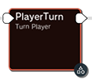

---
tags:
  - event_graph
  - starter_guide
---

# Event Graph Editor - Basics
The tool that gave MoonFlow its name, welcome to the Event Graph Editor! This is a [BYML](https://nintendo-formats.com/libs/common/byaml.html) based [directed](https://www.geeksforgeeks.org/what-is-directed-graph-directed-graph-meaning/) [cyclic](https://www.geeksforgeeks.org/what-is-cyclic-graph/) [graph](https://en.wikipedia.org/wiki/Graph_theory) node editor, or in layman's terms, a Flowchart!

## Opening a Graph
The "Events" tab on your MoonFlow project's homepage contains a list of every single event file in your project (as well as in Super Mario Odyssey, displayed slightly darker and with a note that the archive is not a part of your project). Each of these `.szs` files is an archive, containing any amount of graphs stored in `.byml` format.

If you open a graph that has not been added to your project, it will automatically be added to and saved to your project the first time you save the file.

Unlike the additional complexities of the [Text Editor's file management](../text/file_management.md), there are no noteworthy stipulations with creating, renaming, copying, deleting, or performing any other file operation. These should be done in MoonFlow[^1] and can be done with the standard hotkeys or the toolbar on the bottom of the file list.

[^1]: Using an external file manager is not recommended due to the .graph folder containing important metadata about each of your graphs. Modifying your archives or graphs in an external editor will not update the metadata and can cause issues.

## Navigating a Graph
Each graph file contains a canvas full of nodes. Before modifying the graph in any way, it's important to get the basic controls down. The editor experience is designed to be very similar to other node-based editors.

- **Ctrl + Left-Click Drag** *or* **Middle-Click Drag**: Move camera around canvas (can also be moved using scrollbars on edges)
- **Scroll Mouse Wheel**: Zoom in and out (can also zoom using buttons in header and their associated hotkeys)

- **Left-Click on Nodes**: Interact with nodes
- **Left-Click Drag on Empty Space**: Create selection box to multiselect multiple nodes
- **Right-Click**: Open menu to insert new nodes

There are other important hotkeys and tools, but this is enough to get moving!

## What am I looking at?
Depending on the graph you opened it can be *overwhelming!!* Some of these are absolutely massive, containing hundreds of interconnected nodes all doing complex things. To get started, I recommend looking at the `BossRaid.szs/Talk` graph. To get a general idea of the *flow* of things, let's walk through this very simple graph one step at a time.


To the far left, at the very start of the graph, is an Entry Point. These will appear in every single graph and mark a place that a graph will start at or can jump to. There can be any number of these in a graph, essential for starting the flowchart, jumping between parts of the chart, repeating behavior, and more.

Since this is the first node, try dragging it around by grabbing the header! You can also grab the outgoing port and connect it to a different node. Outgoing ports can only have one connection, so if you change what node the Entry Point is connected to, it will disconnect from the old connection. Nodes can have any amount of incoming connections (except entry points, which can't have any).


The first node that actually does something, `ActionLoop`, and also an introduction to a key concept of these flowcharts. Every chart is connected directly to a `LiveActor`. This can be any actor (including custom modded actors) however is most commonly some type of NPC.

In this example case, our attached actor is the Ruined Kingdom Dragon. (That's what BossRaid is, in case you didn't notice earleir!) The `ActionLoop` node plays an animation on loop, in this case, the Wait action. Some nodes are capable of stopping the flow of the chart until some condition is passed, however that does not include this node, meaning right after the animation starts it will continue onward with the animation continuing to loop.


The first truly complicated node so far, but keeping it simple for now, you can ignore everything below the `Balloon Type: Talk Interaction Balloon` heading.

The `Spawn Dialogue/Text Balloon` node has a multitude of similar functionalities, the most common of which being displaying the mini-overhead text bubbles on NPCs.


<sup>Example of the small overhead text bubbles</sup>

However, it can also be used to spawn Talk Interaction Balloons, which is what is used by our BossRaid graph here! A talk balloon is displayed as a prompt to press the A button. This means that this node, only when set to be a Talk Interaction Balloon, will pause the flow of your graph until the A button is pressed!


<sup>Example of the Ruined Dragon waiting at this point of the flowchart for the player to approach and press the interact button</sup>


Once the player approaches and interacts with the character, we have a `DemoStart` node. Real simple, start a cutscene. The primary effect of this is that all control is taken away from the player.


Another simple node, rotate the player to face towards the NPC running the graph. This automatically handles playing animations and smoothing the rotation.


This node appears deceptively simple, because in the flowchart it only has two properties. However, the setup required to get a camera up and can be quite troublesome. The actor that this flowchart is connected to as an Object ID, and in order to have a successful camera start, the stage needs a matching `CameraParam` entry. The Camera Name in the flowchart is used as the suffix.

Here is what the `CameraParam` entry for BossRaid looks like so you can get an idea of what makes it tick, but a full camera tutorial is well outside the scope of this guide.

```yaml
    - Class: {Name: 会話用2点間}
      Id: {ObjId: obj651, Suffix: Default}
      Param:
        AngleH: 50.00000
        AngleV: 20.00000
        InterpoleCurveType: EaseOut
        MinDistance: 3500.00000
```


Next up, another looping action! This node is responsible from switching the ruined dragon from his idle animation to the mouth movement animation


One of the most important nodes of the whole set, the `MessageTalk` node. This node is responsible for displaying dialogue text to the screen, with each page being advanced by pressing A. The flowchart will only continue once all pages of text have been advanced past.

This node can fetch its text in a variety of ways, the most common being either a direct text source or Stage/`MapUnit` lookups. BossRaid uses a direct lookup, grabbing `SystemMessage/BossMessage/BossRaidTalk` as the text, which in English reads "So... tired..."

Stage text lookups use a similar but simpler system to the camera lookup system. The parent actor's `Object ID` and the Flowchart's `Parameter Name` will be used to search for a string in the current stage's `StageMessage` text file. As example, if an object had id `obj100` and the `Parameter Name` was `Talk` the `StageMessage` text file would need an entry titled `Talk_obj100`.


Now that we've completed progressing through the Ruined Dragon's dialog, it's time to wrap up the flowchart. The camera that was started earlier is ended to ensure normal behavior once the player is granted control again.


The cutscene is ended, restoring player control


And last but not least, we have a jump entry node! This will instantly warp the "playhead" to the `Init` entry point, which is where we started! The start of the graph will reset his animation to idle and spawn a new talk interaction balloon, allowing the player to leave or talk to the dragon again!

## What next?
There is a whole world to explore with the event graph editor, with a whopping 102 different nodes implemented by Nintendo, and now MoonFlow as well. Play around with it, have some fun, and study the base game's charts to learn all the neat tricks you can pull off in such a simple system.

More info for specific nodes and advanced behavior can be found in this documentation folder.