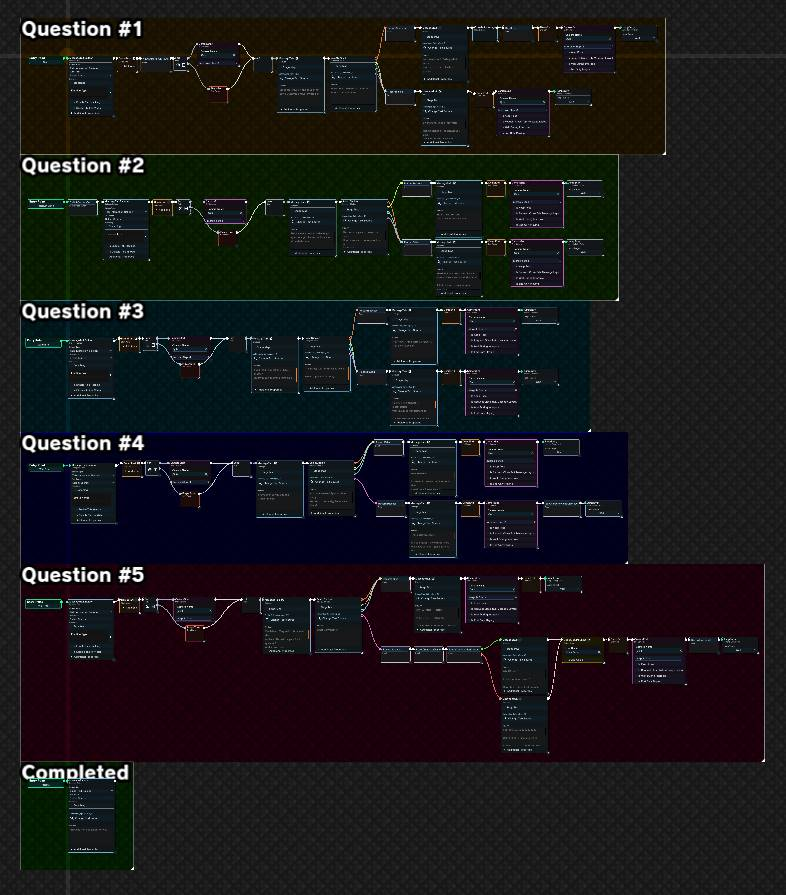

---
tags:
  - event_graph
---
# Organizing Event Graphs
Once you get to building more and more complex event flows, you're gonna end up with a LOT of nodes. If you aren't careful, this can turn into an absolute mess of spaghetti that will be impossible to follow not just for others, but you as well. However, by employing a few simple tricks and principles you can keep a smooth flow!

## Left-to-Right
Event flows are [directed graphs](https://www.geeksforgeeks.org/what-is-directed-graph-directed-graph-meaning/), meaning that they travel in a specific direction. In the case of MoonFlow, incoming connections come in on the left side of a node, and outgoing connections leave on the right side of a node. You can think about it like reading an English book, each word comes one after the other left-to-right. Now imagine if, while reading a book, the author instructed you to jump backwards a few words and read an earlier sentence?? It gets confusing to follow fast!

The simplest way to keep your charts in order is to always go left-to-right, only travelling backwards if absolutely necessary. If you do need to travel backwards, try to position your nodes as clearly as possible, and feel free to add [comments or custom colors](user_data.md) to the backtracking nodes to help guide the reader!

## Groups
At the top of the "Add Node" menu is a special kind of node called a group. In fact, calling it a node at all is a bit of a misnomer considering that it doesn't actively influence your graph in any way.

Groups are organization tools, and work as a resizable, renamable, and colorable block. If a large section of nodes all serve a common goal (starting dialogue, asking the player a question and handling the result, etc.) it can be surrounded in a group to quickly dictate their shared purpose. The text showing the name of a group also doesn't change size as the user zooms in or out, making it super handy for viewing the entire graph as a whole. 

If you want a good example of utilizing groups, take a look at `SphinxQuiz/SphinxQuiz`, the Sand Kingdom sphinx event flow. Each question is broken off into a separate group, making it super easy to find exactly which question you're looking for.

## Entry Points
Despite the name, entry points do not have to be used as a starting point! Let's say you have one super long continuous event, like a ridiculously long dialogue sequence, full of dozens of animations. Instead of needing to scroll left and right for miles to find what you're looking for, it can be a good idea to jump down a row and start again from the left.

But how do you do this without seriously breaking the left-to-right rule? Entry points! There is no rule that entry points must be the *start* of an event, they work just like a jump target. Define a new entry point on the far left of your graph and end your long sequence with an entry point jump. Execution of your flowchart will instantly hop from the jump node to the new entry point, splitting what would be one massive sequence into individual smaller segments, much easier to manage.

## Comments
Last but not least, just like writing code it can be super valuable to add comments! Clicking the little user data bubble on any node allows you to add a bunch of extra data to your node including comments. These have no effect on the execution of your graph, just provides a convenient space to leave extra notes to your future self or others.

For more information on user data, look [here](user_data.md).