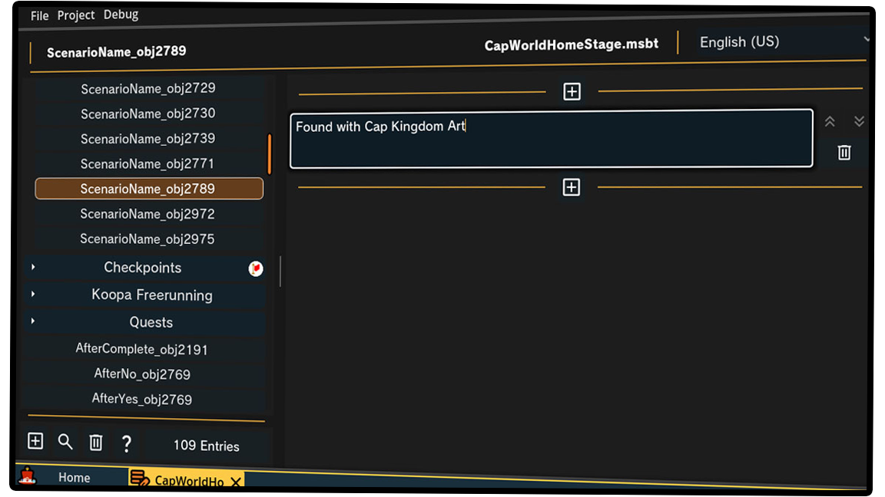
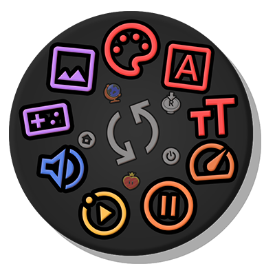
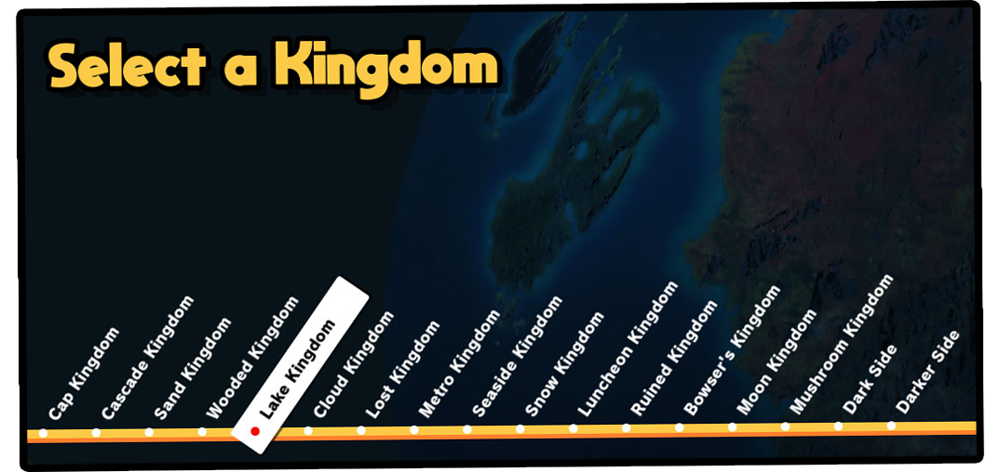

<h1 style="text-align:center">
	
		Super Mario Odyssey
	
	
		:
	
	
		MoonFlow
	
</h1>
  
Get with the Flow

MoonFlow is a Super Mario Odyssey mod development tool designed to tackle some of the largest challenges of advanced RomFS development. Being created by a mod developer who has worked with SMO since the start of 2019, this passion project is built off years of obscure knowledge, all bundled together in a user-friendly but expansive package!

## Features

### Event Graph Editor
Open up the event editor and get designing! All 102 event nodes implemented into the game can be clicked, dragged, connected, and tweaked to your heart's content. Use this to make changes to the game's existing behavior, or create new graphs to build cutscenes, dialog sequences, and more!

Image shows the Event Flow Graph from the Ruined Kingdom dragon, playing camera animations, model animations, and text dialogue.

Split it up! Your graphs can have branching paths, letting conditions determine what happens next. Build the ultimate quiz show, charge 9999 coins for a coin, skies the limits!

Image shows Jaxi checking to see if the Player has enough coins, before providing the user a choice if they want to pay the total.

### Text Editor
Get your imagination up and running, it's a better time than ever to get writing! With a brand new, built from the ground up text editor, the annoying days of advanced users needing a hex editor open on the side are long gone.

Image shows MSBT Text Editor, editing the name of a Power Moon from Cap Kingdom

Featuring cross-language syncing, it's possible to create mods that support every single game language without needing to manually copy changes between all languages!

On top of that, this editor introduces the Tag Wheel! With the press of a button, open a wheel to insert any tag into your text. These can display pictures, change colors, fonts, text animations, play sound effects, and way more.

Picture depicting the Tag Wheel which shows (in clockwise order from the top) a color tag, font tag, font size tag, text speed tag, text pause tag, text animation tag, sound tag, controller icon tag, and picture icon tag

### Kingdom Editor
The Odyssey globe screen has been recreated on your desktop. Pick a destination in this dynamic menu capable of expanding to more than 17 kingdoms and get customizing!

> *Adding additional kingdoms requires exefs patching and additional tools, [reference guide here](https://github.com/octember8/SMO-Kingdom-18/blob/main/Kingdom%2018%20Implementation%20Guide.md)*

Picture depicting the application's kingdom selection menu

Any kingdom is fully customizable! Add stages, remove stages, add Power Moons, remove Power Moons, and more features are all available. The old complexities of managing UIDs and bit flags are gone, enjoy the power of creating what you want to make, not bashing your head against troubleshooting.

Picture showcasing Cascade Kingdom's Power Moon list, with Madame Broode's Multi Moon expanded to show its properties

## Setup
Getting started with MoonFlow is super easy. Go to the [releases](https://github.com/Amethyst-szs/MoonFlow/releases) tab and download the latest version for your operating system.

On startup you'll need to provide at least 1 RomFS dump from your Super Mario Odyssey game files. This can be done via a modded switch or emulator. You can add game files for every released version of Mario Odyssey, but note that each project you create is tied to a specific version and cannot be opened unless you have a game file path for that specific version.

## [Documentation](https://github.com/Amethyst-szs/MoonFlow/blob/stable/MoonFlow/docs/front_door.md)
The wiki is available both on the GitHub repo and built-in to the app itself. [View the online wiki here](https://github.com/Amethyst-szs/MoonFlow/blob/stable/MoonFlow/docs/front_door.md)!

## Running & Compiling from Source
> This section is only for developers wanting to modify or debug MoonFlow

MoonFlow runs on the [Godot Engine](https://godotengine.org/) and [C#](https://dotnet.microsoft.com/en-us/languages/csharp). This means you'll need a .NET supported version of the Godot Editor to open the project and make changes. If you don't have the C# enabled engine installed, [download here](https://godotengine.org/download/) and follow the [Godot C# setup](https://docs.godotengine.org/en/stable/tutorials/scripting/c_sharp/c_sharp_basics.html#introduction) guide.

## Support
This project is not for profit, is not affiliated with Nintendo, and does not encourage or distribute any pirated content owned by Nintendo. If you want to donate to show appreciation, you can do so on my [Ko-Fi](https://ko-fi.com/amethystszs) page, though there is no additional rewards or offers for doing so. This project is free and open source for all to use, only donate if you really want to!

## Credits
- [Amethyst-szs](http://www.youtube.com/@AmethystSZS): Project Lead, Programmer, & Designer
- [Godot Foundation](https://godotengine.org/): Application Engine
- [Microsoft](https://dotnet.microsoft.com/en-us/languages/csharp): C#
- [EPD-Libraries](https://github.com/EPD-Libraries): Backend Nintendo file format libs
- [Material Symbols](https://fonts.google.com/icons): SVG Graphics

A more extensive and up-to-date list of all credits can be found in the Contributions section of the app!